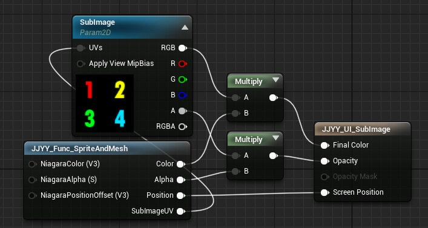
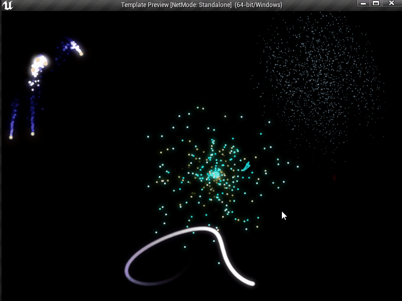
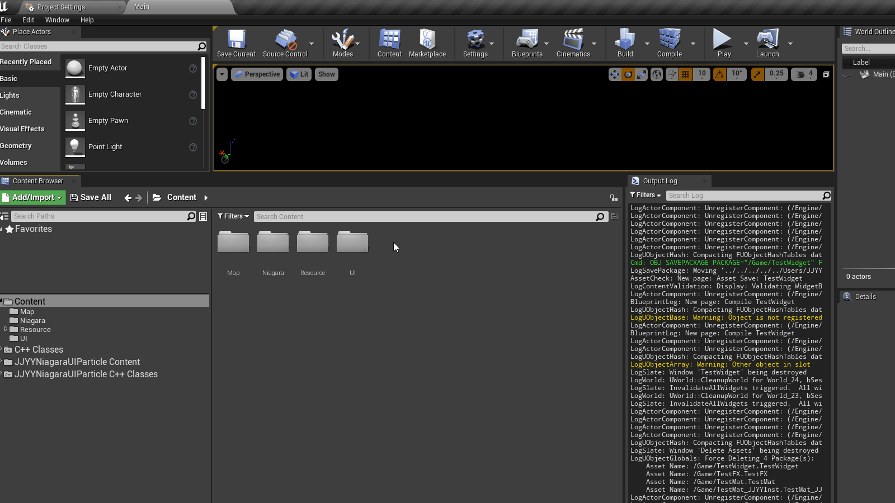

# JJYYNiagaraUIParticle

[](https://github.com/RichardLitt/standard-readme)

这是一个UE4中在UI上使用粒子系统的插件。使用过[NiagaraUIRenderer](https://github.com/SourySK/NiagaraUIRenderer)后，发现不支持浮点颜色和Mesh，在做特效的时候受限比较大。同时由于要创建两套材质经常出现混乱，但是由于改进方向和原有的做法差异过大不便于合并，所以重新写了一个。
具体改进方式有：
- 支持实例化渲染
- 支持mesh渲染
- 支持浮点颜色的自动曝光
- 支持一套UI材质在Niagara和Slate中同时使用
- 材质使用简单

简单材质：



Demo:




## 内容列表

- [安装](#安装)
- [使用说明](#使用说明)
- [打包](#打包)
- [维护者](#维护者)
- [使用许可](#使用许可)

## 安装

直接下载Zip文件，或者使用git命令：

```
git clone https://github.com/JJYYs/JJYYNiagaraUIParticle.git
```

## 使用说明
下载完成后双击 Template.uproject 启动
本插件基于 4.26 开发，在Win64下完成测试，理论上支持全平台。

本插件是希望不修改引擎源码，由于Slate的Shader默认提供的功能有限，所以在使用上有一定的限制：
- 最高支持的游戏分辨率：14000 x 14000 像素
- 最高支持的单个粒子大小：1600 x 1600 像素
- 最高支持SubImage：16 x 16
- Mesh的尺寸最好在100 x 100 x 100左右
- Mesh投影使用的是X向右Z向上
- Niagara更换Mesh后需要编译一下UMG


简单使用:


## 打包
因为没有准备预编译的文件，目前需要放到C++工程中才能正确打包。

## 维护者

[@JJYYs](https://github.com/JJYYs)

## 使用许可

[MIT](https://github.com/RichardLitt/standard-readme/blob/master/LICENSE) © JJYY